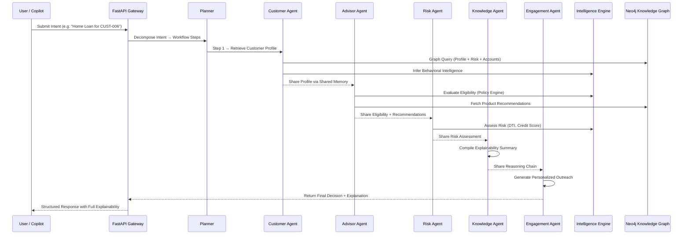

<div align="center">

# 🏦 Ontology-Driven Agentic Banking Platform

### *The AI Operating System for Bank 4.0*

**Where Humans, Data, and AI Agents Work Together on a Single Source of Business Truth**

---


</div>

---

## 📋 Executive Summary

This platform is the **semantic intelligence layer** for next-generation banking. By modeling the bank as interconnected business entities — customers, accounts, loans, transactions, products, policies, risks, and regulatory obligations — along with their relationships and governed actions, we create a **unified operational representation** of the entire banking ecosystem.

This ontology enables AI agents to move beyond simple question answering to **contextual reasoning**, **autonomous decision support**, and **governed execution** of banking workflows — all with full explainability, compliance, and auditability.

---

## 🔍 Why This Project Exists

**Bank 4.0** demands a shift from digital banking to intelligent, autonomous, and context-aware banking. While banks possess vast amounts of data, it remains **fragmented across legacy systems, products, and departments**, preventing AI from understanding the full business context required to make reliable decisions.

| Challenge | How We Solve It |
|---|---|
| **Fragmented Data** | Unified Banking Ontology as single source of truth |
| **No Business Context for AI** | Graph-based semantic relationships enable contextual reasoning |
| **Governance & Compliance Gaps** | Policy engine enforces rules at every decision point |
| **Black-Box AI Decisions** | Full explainability via reasoning chains, evidence, and graph paths |
| **Siloed Departments** | Multi-agent collaboration with shared semantic memory |
| **Hard-coded Business Logic** | YAML-driven policy rules with hot-swap capability |

---

## 🏗️ System Architecture

```
                    Users / Bank Employees / Customers
                                  │
                                  ▼
                     Web Application (Next.js + React)
                                  │
                                  ▼
                     API Gateway (FastAPI Backend)
                                  │
            ┌─────────────────────┴─────────────────────┐
            │                                           │
            ▼                                           ▼
    Agent Orchestration Layer                  Authentication & RBAC
    (LangGraph StateGraph)
            │
            ▼
     Multi-Agent Pipeline
     ┌──────────┬──────────┬──────────┬──────────┬──────────┐
     │Customer  │Advisor   │Risk      │Knowledge │Engagement│
     │Agent     │Agent     │Agent     │Agent     │Agent     │
     └──────────┴──────────┴──────────┴──────────┴──────────┘
            │
            ▼
      Intelligence Engine
      ┌──────────┬──────────┬──────────┬──────────┐
      │Policy    │Eligiblty │Fraud     │Financial │
      │Engine    │Engine    │Engine    │Health    │
      └──────────┴──────────┴──────────┴──────────┘
            │
            ▼
        Banking Ontology Layer (OWL/TTL)
     (Business Objects • Relationships • Policies • Actions)
            │
            ▼
         Neo4j Knowledge Graph (Neosemantics/n10s)
            │
            ▼
      Integration & Data Layer
      (Core Banking | CRM | Loans | Payments | KYC)
```

### Request Flow



---

## 🧩 Platform Components

### 1. Banking Ontology (`banking-ontology/`)

The formal OWL/Turtle ontology defining the bank's operational vocabulary:

- **97KB OWL** + **44KB Turtle** — formal class hierarchies, object properties, data properties
- **Core Classes**: `Customer`, `Account`, `Loan`, `Transaction`, `Product`, `Policy`, `RiskProfile`, `Event`, `Goal`, `Merchant`, `Branch`, `Employee`, `ServiceRequest`, `Recommendation`
- **Subclass Hierarchies**: `DepositAccount → SavingsAccount | CheckingAccount`, `LendingAccount → LoanAccount | CreditCardAccount`, `Loan → HomeLoan | AutoLoan | PersonalLoan`
- Imported into Neo4j via **Neosemantics (n10s)** for graph-native ontology enforcement

### 2. Knowledge Graph (`knowledge-graph/`)

Neo4j-powered graph database storing the instantiated ontology:

| Node Type | Description |
|---|---|
| `Customer` | Demographics, credit score, income, segment |
| `Account` | Balance, status, product linkage |
| `Transaction` | Amount, timestamp, channel, fraud flag |
| `Loan` | Amount, rate, tenure, outstanding balance |
| `Product` | Name, type, base rate, policy constraints |
| `Policy` | Name, version, effective date, status |
| `RiskProfile` | Score, rating per customer |
| `Event` | Name, severity, timestamp, customer impact |
| `Merchant` | Name, category, risk rating |
| `Branch` | Name, location, cash reserves |
| `Employee` | Name, role, branch assignment |
| `Goal` | Type, target amount, funding account |
| `ServiceRequest` | Category, priority, status, assignment |
| `Recommendation` | Action, confidence, product linkage |

**Key Relationships**: `OWNS`, `HAS_TRANSACTION`, `AT`, `CONSTRAINED_BY`, `HAS_RISK_PROFILE`, `MANAGES`, `AFFECTS`, `HAS_GOAL`, `FUNDED_BY`, `INSTANTIATES_PRODUCT`, `REPRESENTS_LOAN`, `RECEIVED_RECOMMENDATION`, `RECOMMENDS_PRODUCT`, `SUBMITTED_REQUEST`, `ASSIGNED_TO`, `ASSIGNED_TO_BRANCH`

### 3. Semantic API Layer (`semantic-layer/`)

FastAPI-powered gateway that abstracts graph queries into banking domain concepts:

| Endpoint | Purpose |
|---|---|
| `/api/customers` | Customer Intelligence |
| `/api/accounts` | Account Information |
| `/api/transactions` | Transaction Operations |
| `/api/products` | Product Catalog |
| `/api/recommendations` | Product Recommendations |
| `/api/policies` | Policy & Rule Knowledge |
| `/api/events` | Event Streams & Logs |
| `/api/reasoning` | Semantic Reasoning Engine |
| `/api/ontology` | Ontology Schema Navigator |
| `/api/operations` | Banking Operations |
| `/api/agent` | Agent Orchestrator Gateway |

**Services**: `CustomerService`, `AdvisorService`, `RiskService`, `OperationsService`, `RecommendationService`, `OntologyService`, `GraphService`

### 4. Intelligence Engine (`intelligence-engine/`)

Domain-specific reasoning engines powered by YAML-driven policy rules:

| Engine | Capability |
|---|---|
| **Policy Engine** | Loads and caches YAML business rules for loans, fraud, risk, investments, engagement |
| **Eligibility Engine** | Evaluates customer eligibility against policy thresholds (credit score, DTI, income, age) |
| **Fraud Engine** | Real-time transaction risk scoring: blacklist checks, velocity limits, location anomalies, device fingerprinting |
| **Financial Health Engine** | Portfolio analysis, savings ratios, debt coverage metrics |
| **Recommendation Engine** | Product suitability scoring based on customer profile and financial health |
| **Customer Intelligence Engine** | Behavioral inference: spending patterns, churn risk, digital adoption, segment classification |
| **Event Engine** | Reactive processing for salary credits, EMI misses, KYC expiry, and lifecycle events |
| **Engagement Engine** | Campaign message generation and channel routing |
| **Explanation Engine** | Structures every decision into evidence, policies, reasoning steps, confidence, and graph paths |

### 5. Multi-Agent Platform (`agent-platform/`)

LangGraph-powered multi-agent system with shared semantic memory:

| Agent | Role |
|---|---|
| **Planner** | Intent classification → workflow decomposition into ordered agent steps |
| **Customer Agent** | Profile retrieval, behavioral synthesis, relationship context |
| **Advisor Agent** | Product eligibility, investment recommendations, financial planning |
| **Risk Agent** | Credit assessment, fraud evaluation, DTI analysis |
| **Operations Agent** | KYC processing, service requests, branch operations |
| **Knowledge Agent** | Explainability compilation, reasoning chain summarization |
| **Engagement Agent** | Personalized outreach, campaign messaging, channel optimization |

**Shared Memory** (`SharedState`): All agents read/write to a unified Pydantic state model containing customer profile, financial health, risk assessment, recommendations, policies consulted, reasoning chain, evidence, confidence scores, and observability logs.

**Workflow Orchestration**: LangGraph `StateGraph` with conditional routing — the Planner maps intent to an ordered sequence of agents, and the workflow manager executes them sequentially with shared state propagation.

### 6. Banking Copilot & Dashboard (`frontend/`)

Next.js 15 + React 19 enterprise interface with:

| View | Description |
|---|---|
| **Landing Page** | Platform overview and quick navigation |
| **Banking Copilot** | Conversational AI interface for natural language banking queries |
| **Agent Collaboration** | Real-time visualization of multi-agent workflows |
| **Graph Explorer** | Interactive knowledge graph visualization (React Flow) |
| **Reasoning Explorer** | Step-by-step reasoning chain inspection |
| **Ontology Explorer** | Browse the formal banking ontology structure |
| **Scenario Manager** | Run and compare pre-built banking scenarios |
| **Event Simulator** | Trigger lifecycle events and observe system reactions |
| **Customer 360** | Unified customer view with all relationships |
| **Executive Dashboard** | Operational metrics and KPIs |
| **Judge Dashboard** | AI decision audit and explainability review |

---

## 🧠 Ontology Architecture

### Core Domains

```
Banking Ontology
├── Party Domain
│   ├── Customer (IndividualCustomer)
│   ├── Employee (RelationshipManager)
│   └── Branch
├── Product Domain
│   ├── Product
│   ├── Policy (constraints)
│   └── Recommendation
├── Account Domain
│   ├── DepositAccount (Savings, Checking)
│   └── LendingAccount (Loan, CreditCard)
├── Transaction Domain
│   ├── Transaction (Debit, Credit)
│   └── Merchant
├── Risk Domain
│   ├── RiskProfile
│   └── FraudIndicator
├── Lifecycle Domain
│   ├── Event
│   ├── ServiceRequest
│   └── Goal
└── Governance Domain
    ├── LoanPolicy
    ├── FraudPolicy
    ├── InvestmentPolicy
    ├── RiskPolicy
    └── EngagementPolicy
```

### Policy Rules (YAML-Driven)

```yaml
# Example: Home Loan Policy (loan_rules.yaml)
home_loan:
  name: "SBI Griha Pravesh Home Loan Policy"
  id: "POL-LOAN-HOME-001"
  min_credit_score: 650
  max_dti_ratio: 0.50
  min_annual_income_inr: 500000
  min_age: 21
  max_age: 65

# Example: Fraud Detection (fraud_rules.yaml)
transaction_risk:
  name: "SBI Real-time Transaction Risk Policy"
  id: "POL-FRAUD-TX-001"
  velocity_limit_per_hour: 5
  single_tx_amount_threshold_inr: 50000.0
  merchant_blacklist: ["M-999", "M-666"]
```

---

## 🔬 Explainable AI

Every decision produced by the platform includes a structured explanation:

```json
{
  "decision": "Eligible",
  "evidence": {
    "creditScore": 748,
    "annualIncome": 132702.39,
    "debtToIncomeRatio": 0.32
  },
  "supporting_policies": [
    { "id": "POL-LOAN-HOME-001", "name": "SBI Griha Pravesh Home Loan Policy" }
  ],
  "reasoning_steps": [
    "Credit score 748 meets minimum threshold of 650",
    "DTI ratio 0.32 is within maximum limit of 0.50",
    "Annual income ₹1,32,702 exceeds minimum ₹5,00,000 requirement"
  ],
  "confidence": 0.95,
  "graph_path": [
    { "node": "Customer:CUST-006", "rel": "OWNS", "target": "Account:ACC-SAV-006" },
    { "node": "Account:ACC-SAV-006", "rel": "INSTANTIATES_PRODUCT", "target": "Product:PROD-SAV-001" }
  ],
  "alternative_outcomes": []
}
```

---

## 🎯 Demo Scenarios

| # | Scenario | Agents Involved | Key Decision |
|---|---|---|---|
| 1 | **Home Loan Journey** | Customer → Advisor → Risk → Knowledge → Engagement | Eligibility + Rate Offer |
| 2 | **Fraud Detection** | Customer → Risk → Operations → Knowledge → Engagement | Block / Flag / Approve |
| 3 | **Investment Advice** | Customer → Advisor → Risk → Knowledge → Engagement | Product Recommendations |
| 4 | **Salary Credit Event** | Customer → Advisor → Engagement | Deployment Suggestions |
| 5 | **KYC Expiry** | Customer → Operations → Knowledge → Engagement | Compliance Alert |
| 6 | **Card Upgrade** | Customer → Advisor → Risk → Knowledge → Engagement | Upgrade Eligibility |
| 7 | **Customer Complaint** | Customer → Operations → Engagement | Resolution Routing |
| 8 | **Insurance Recommendation** | Customer → Advisor → Knowledge → Engagement | Suitability Assessment |
| 9 | **EMI Missed Alert** | Event Engine → Risk Update → Engagement | Risk Escalation |

---

## 📁 Repository Structure

```
SBI/
├── banking-ontology/           # Formal OWL/Turtle Ontology
│   ├── ontology/
│   │   ├── banking.owl         # OWL ontology (97KB)
│   │   ├── banking.ttl         # Turtle serialization (44KB)
│   │   └── prefixes.ttl        # Namespace prefixes
│   ├── docs/                   # Ontology documentation
│   └── examples/               # Usage examples
│
├── knowledge-graph/            # Neo4j Knowledge Graph
│   ├── cypher/
│   │   ├── schema.cypher       # Neosemantics config + ontology import
│   │   ├── constraints.cypher  # 15 uniqueness constraints
│   │   ├── indexes.cypher      # Performance indexes
│   │   ├── load-data.cypher    # CSV → Graph data loading (14 entity types)
│   │   ├── sample-queries.cypher
│   │   └── reasoning-queries.cypher  # Agent-specific reasoning queries
│   ├── datasets/               # Generated synthetic CSV data
│   ├── docker/
│   │   └── docker-compose.yml  # Neo4j 5.18 + APOC + n10s
│   ├── ontology/               # Ontology files for Neo4j import
│   └── scripts/                # Data generation & graph loading
│
├── semantic-layer/             # FastAPI Semantic Query Gateway
│   ├── app/
│   │   ├── main.py             # Application entry point (12 API routers)
│   │   ├── api/                # REST endpoints (12 modules)
│   │   ├── services/           # Business logic services (7 modules)
│   │   ├── schemas/            # Pydantic response models
│   │   ├── queries/            # Parameterized Cypher queries
│   │   └── cache/              # Query result caching
│   └── tests/
│
├── intelligence-engine/        # Domain Reasoning Engines
│   ├── engines/
│   │   ├── policy_engine.py    # YAML rule loader with caching
│   │   ├── eligibility_engine.py
│   │   ├── fraud_engine.py     # Multi-factor fraud scoring
│   │   ├── financial_health_engine.py
│   │   ├── recommendation_engine.py
│   │   ├── customer_intelligence_engine.py
│   │   ├── event_engine.py     # Lifecycle event reactor
│   │   ├── engagement_engine.py
│   │   └── reasoning_engine.py
│   ├── explainability/
│   │   └── explanation_engine.py  # Structured explanation builder
│   ├── rules/                  # YAML business rule definitions
│   │   ├── loan_rules.yaml
│   │   ├── fraud_rules.yaml
│   │   ├── investment_rules.yaml
│   │   ├── risk_rules.yaml
│   │   └── engagement_rules.yaml
│   ├── run_scenarios.py        # CLI scenario simulator (9 scenarios)
│   └── tests/
│
├── agent-platform/             # LangGraph Multi-Agent System
│   ├── agents/
│   │   ├── customer_agent.py
│   │   ├── advisor_agent.py
│   │   ├── risk_agent.py
│   │   ├── operations_agent.py
│   │   ├── knowledge_agent.py
│   │   └── engagement_agent.py
│   ├── orchestrator/
│   │   ├── orchestrator.py     # Central entry gateway
│   │   ├── planner.py          # Intent → Workflow decomposition
│   │   ├── workflow_manager.py # LangGraph StateGraph compiler
│   │   ├── task_router.py
│   │   └── memory_manager.py
│   ├── memory/
│   │   ├── shared_context.py   # SharedState (Pydantic model)
│   │   ├── conversation_memory.py
│   │   ├── customer_context.py
│   │   └── workflow_state.py
│   ├── tools/                  # Agent tool interfaces
│   │   ├── semantic_layer_tool.py
│   │   ├── intelligence_tool.py
│   │   ├── policy_tool.py
│   │   ├── reasoning_tool.py
│   │   ├── recommendation_tool.py
│   │   └── event_tool.py
│   ├── workflows/              # Pre-built workflow definitions
│   └── run_demos.py
│
├── frontend/                   # Next.js 15 Enterprise UI
│   ├── app/                    # App router pages
│   ├── components/
│   │   ├── copilot/            # Banking Copilot chat interface
│   │   ├── agents/             # Agent collaboration views
│   │   ├── graph/              # Knowledge graph explorer
│   │   ├── reasoning/          # Reasoning chain inspector
│   │   ├── ontology/           # Ontology browser
│   │   ├── scenarios/          # Scenario runner
│   │   ├── events/             # Event simulator
│   │   ├── dashboard/          # Customer 360, Executive, Judge dashboards
│   │   └── shared/             # Sidebar, Landing page
│   ├── lib/                    # API client
│   └── store/                  # Zustand state management
│
├── demo/                       # Demo & Deployment
│   ├── scripts/
│   │   ├── seed_demo.py        # Database seeder
│   │   ├── run_demo.py         # Demo runner
│   │   └── reset_demo.py       # Database reset
│   ├── scenarios/              # Scenario definitions
│   ├── dashboards/
│   ├── deployment/
│   ├── monitoring/
│   └── walkthrough/
│
├── run.sh                      # One-click application launcher
├── RUNNING.md                  # Detailed run instructions
└── README.md                   # This file
```

---

## ⚙️ Technology Stack

| Layer | Technology | Purpose |
|---|---|---|
| **Backend** | Python 3.11+ / FastAPI | High-performance REST API gateway |
| **Knowledge Graph** | Neo4j 5.18 Community | Graph database with APOC + Neosemantics |
| **Ontology** | OWL 2 / Turtle (RDF) | Formal banking domain model |
| **Agent Framework** | LangGraph (StateGraph) | Multi-agent orchestration with shared state |
| **Intelligence** | Custom Python Engines | Policy, eligibility, fraud, recommendations |
| **Rules** | YAML | Hot-swappable business rule definitions |
| **Frontend** | Next.js 15 / React 19 / TypeScript | Enterprise dashboard + copilot UI |
| **Visualization** | React Flow / Recharts / Framer Motion | Graph explorer + charts + animations |
| **State Mgmt** | Zustand | Lightweight frontend state |
| **Data Fetching** | TanStack React Query | Server state with caching |
| **Containerization** | Docker Compose | Neo4j + application services |
| **Styling** | Tailwind CSS 4 | Utility-first CSS framework |

---

## 🚀 Installation

### Prerequisites

- **Python 3.11+** with `pip`
- **Node.js 18+** with `npm`
- **Docker** and **Docker Compose**
- **Neo4j** (provided via Docker)

### Step 1: Clone the Repository

```bash
git clone <repository-url>
cd SBI
```

### Step 2: Set Up Neo4j Database

```bash
cd knowledge-graph/docker
docker compose up -d
```

Wait for Neo4j to be ready at `http://localhost:7474` (credentials: `neo4j` / `sbi_banking_password`).

### Step 3: Set Up Python Environment

```bash
cd semantic-layer
python3 -m venv .venv
source .venv/bin/activate
pip install -r requirements.txt
```

### Step 4: Set Up Frontend

```bash
cd frontend
npm install
```

### Step 5: Seed the Database

```bash
source semantic-layer/.venv/bin/activate
python3 demo/scripts/seed_demo.py
```

---

## ⚡ Quick Start

### Option 1: One-Click Launch (Recommended)

```bash
./run.sh
```

This will: start Neo4j → seed database → launch FastAPI backend → launch Next.js frontend.

- **Frontend**: http://localhost:3000
- **API Docs**: http://localhost:8000/docs
- **Neo4j Browser**: http://localhost:7474

Press `Ctrl+C` to gracefully stop all services.

### Option 2: Manual Launch

```bash
# Terminal 1 — Neo4j
cd knowledge-graph/docker && docker compose up -d

# Terminal 2 — Backend
cd semantic-layer
source .venv/bin/activate
uvicorn app.main:app --host 0.0.0.0 --port 8000 --reload

# Terminal 3 — Frontend
cd frontend && npm run dev

# Terminal 4 (Optional) — Scenario Simulator
cd intelligence-engine
source ../semantic-layer/.venv/bin/activate
python3 run_scenarios.py
```

---

## 🔑 Environment Variables

| Variable | Default | Description |
|---|---|---|
| `NEO4J_URI` | `bolt://localhost:7687` | Neo4j Bolt connection URI |
| `NEO4J_USER` | `neo4j` | Neo4j username |
| `NEO4J_PASSWORD` | `sbi_banking_password` | Neo4j password |
| `API_HOST` | `0.0.0.0` | FastAPI bind host |
| `API_PORT` | `8000` | FastAPI bind port |
| `FRONTEND_PORT` | `3000` | Next.js dev server port |

---

## 🏥 Health Checks

| Service | Endpoint | Expected |
|---|---|---|
| FastAPI | `GET http://localhost:8000/api/health` | `{"status": "operational"}` |
| Neo4j | `http://localhost:7474` | Neo4j Browser UI |
| Frontend | `http://localhost:3000` | Next.js Application |

---

## 🔒 Security Considerations

- **JWT-based Authentication** with Role-Based Access Control (RBAC)
- **API Gateway** mediates all agent-to-data interactions through the semantic layer
- **Governed Execution**: Policy engine enforces business rules before every AI decision
- **Audit Logging**: Full observability logs with agent, action, duration, and timestamp
- **Human-in-the-Loop**: High-risk decisions flagged for manual review via Judge Dashboard
- **Data Isolation**: Agents never access raw database — all queries go through parameterized Cypher via the semantic layer
- **CORS Configuration**: Configurable cross-origin policies for enterprise deployment

---

## 🧭 Design Principles

| Principle | Implementation |
|---|---|
| **Ontology First** | Every entity, relationship, and action is formally defined in OWL before being instantiated in the graph |
| **Shared Semantic Memory** | All agents operate on a single `SharedState` — no isolated silos |
| **Policy-Driven Decisions** | Business rules live in YAML files, not hard-coded logic — enabling hot-swap without redeployment |
| **Explainability by Design** | Every decision carries evidence, policies used, reasoning steps, confidence score, and graph path |
| **Separation of Concerns** | Ontology → Graph → Semantic Layer → Intelligence → Agents → UI — each layer is independently testable |
| **Enterprise Modularity** | New products, regulations, or agents can be added without redesigning the core system |

---

## 🗺️ Roadmap

- [ ] **GraphRAG Integration** — Combine semantic graph traversal with vector-based retrieval for LLM-powered responses
- [ ] **MCP Server Integration** — Model Context Protocol for tool-using LLM agents
- [ ] **Real-time Event Streaming** — Kafka/Redis-based event bus for live banking event processing
- [ ] **Kubernetes Deployment** — Helm charts for production-grade cloud-native deployment
- [ ] **AI Agent Marketplace** — Pluggable domain-specific agents (Treasury, Compliance, Wealth Management)
- [ ] **Regulatory Ontology Extensions** — RBI/SEBI/Basel III compliance knowledge models
- [ ] **Multi-tenant Architecture** — Support for multiple banking institutions on shared infrastructure
- [ ] **Conversational AI (LLM)** — Natural language copilot powered by GraphRAG + ontology context
- [ ] **Advanced Analytics** — Predictive models for churn, cross-sell, and portfolio optimization

---

## 📄 License

This project is proprietary software. All rights reserved.

---

## 🙏 Acknowledgements

- **Neo4j** and the **Neosemantics (n10s)** team for graph-native ontology support
- **LangGraph** for the multi-agent state graph framework
- **FastAPI** for high-performance Python API development
- **Next.js** and **React** teams for the frontend framework
- The **Bank 4.0** vision by Brett King for inspiring the architectural philosophy

---

<div align="center">

**Built with ❤️ for the future of intelligent banking**

*Ontology as the foundational intelligence layer — enabling the next generation of banking where humans, data, and AI agents work together on a single source of business truth.*

</div>
