# Ontology Diagram - SBI Enterprise Banking Ontology

This document provides a conceptual structural model of the OWL 2 DL ontology relationships.

## 1. Core Entity Relationship Map

The following Mermaid diagram outlines how core classes connect in the ontology.

```mermaid
graph TD
    classDef cust fill:#fff9c4,stroke:#fbc02d,stroke-width:2px;
    classDef prod fill:#e1f5fe,stroke:#0288d1,stroke-width:2px;
    classDef acc fill:#e8f5e9,stroke:#388e3c,stroke-width:2px;
    classDef txn fill:#f3e5f5,stroke:#7b1fa2,stroke-width:2px;
    classDef risk fill:#ffebee,stroke:#d32f2f,stroke-width:2px;
    classDef op fill:#fff3e0,stroke:#f57c00,stroke-width:2px;

    %% Entities
    Customer[sbi:Customer]:::cust
    IndividualCustomer[sbi:IndividualCustomer]:::cust
    CustomerHousehold[sbi:CustomerHousehold]:::cust
    CustomerSegment[sbi:CustomerSegment]:::cust
    
    BankingProduct[sbi:BankingProduct]:::prod
    DepositProduct[sbi:DepositProduct]:::prod
    LendingProduct[sbi:LendingProduct]:::prod
    InvestmentProduct[sbi:InvestmentProduct]:::prod
    
    Account[sbi:Account]:::acc
    DepositAccount[sbi:DepositAccount]:::acc
    LendingAccount[sbi:LendingAccount]:::acc
    InvestmentAccount[sbi:InvestmentAccount]:::acc
    
    Transaction[sbi:Transaction]:::txn
    Merchant[sbi:Merchant]:::txn
    MerchantCategory[sbi:MerchantCategory]:::txn
    
    FinancialGoal[sbi:FinancialGoal]:::cust
    InvestmentPortfolio[sbi:InvestmentPortfolio]:::acc
    InvestmentAsset[sbi:InvestmentAsset]:::acc
    
    Loan[sbi:Loan]:::acc
    Collateral[sbi:Collateral]:::risk
    
    CreditCard[sbi:CreditCard]:::acc
    CreditCardAccount[sbi:CreditCardAccount]:::acc
    
    RiskProfile[sbi:RiskProfile]:::risk
    FraudAlert[sbi:FraudAlert]:::risk
    KYCRecord[sbi:KYCRecord]:::risk
    IdentityDocument[sbi:IdentityDocument]:::risk
    
    InteractionHistory[sbi:InteractionHistory]:::cust
    InteractionContext[sbi:InteractionContext]:::cust
    DeviceContext[sbi:DeviceContext]:::cust
    
    ServiceRequest[sbi:ServiceRequest]:::op
    Employee[sbi:Employee]:::op
    Branch[sbi:Branch]:::op
    Vault[sbi:Vault]:::op
    Policy[sbi:Policy]:::risk

    %% Hierarchies (Subclasses)
    IndividualCustomer -.->|rdfs:subClassOf| Customer
    DepositProduct -.->|rdfs:subClassOf| BankingProduct
    LendingProduct -.->|rdfs:subClassOf| BankingProduct
    InvestmentProduct -.->|rdfs:subClassOf| BankingProduct
    DepositAccount -.->|rdfs:subClassOf| Account
    LendingAccount -.->|rdfs:subClassOf| Account
    InvestmentAccount -.->|rdfs:subClassOf| Account
    CreditCardAccount -.->|rdfs:subClassOf| Account

    %% Core Semantic Connections
    IndividualCustomer -->|sbi:memberOfHousehold| CustomerHousehold
    Customer -->|sbi:belongsToSegment| CustomerSegment
    Customer -->|sbi:ownsAccount| Account
    Account -->|sbi:instantiatesProduct| BankingProduct
    
    Account -->|sbi:originatesTransaction| Transaction
    Transaction -->|sbi:occursAtMerchant| Merchant
    Merchant -->|sbi:belongsToCategory| MerchantCategory
    
    Customer -->|sbi:pursuesGoal| FinancialGoal
    FinancialGoal -->|sbi:fundedByAccount| Account
    
    InvestmentAccount -->|sbi:containsPortfolio| InvestmentPortfolio
    InvestmentPortfolio -->|sbi:holdsAssetHolding| InvestmentAsset
    
    LendingAccount -->|sbi:represents| Loan
    Loan -->|sbi:securedByCollateral| Collateral
    Loan -->|sbi:constrainedBy| Policy
    
    CreditCard -->|sbi:linkedToAccount| CreditCardAccount
    
    Customer -->|sbi:hasRiskProfile| RiskProfile
    Customer -->|sbi:hasKYCRecord| KYCRecord
    KYCRecord -->|sbi:reliesOnDocument| IdentityDocument
    
    Transaction -->|sbi:triggersFraudAlert| FraudAlert
    
    Customer -->|sbi:hasInteractionLog| InteractionHistory
    InteractionHistory -->|sbi:occursInContext| InteractionContext
    InteractionContext -->|sbi:contextContainsDevice| DeviceContext
    
    Customer -->|sbi:submitsRequest| ServiceRequest
    ServiceRequest -->|sbi:assignedTo| Employee
    Employee -->|sbi:employeeAssignedToBranch| Branch
    Branch -->|sbi:branchContainsVault| Vault
```

## 2. Key Semantic Patterns

1.  **Account Ownership Pattern**: Traces checkings, savings, loans, and credit cards back to customers via the `sbi:ownsAccount` property. Reasoning over subclasses ensures that querying for `sbi:Account` returns all deposit, credit card, and investment ledger instances.
2.  **Compliance Tracking Pattern**: Binds `sbi:Customer` to `sbi:KYCRecord`, which relies on `sbi:IdentityDocument`. This pattern allows the **Risk Agent** to enforce that no account can transition status to `Status_Active` without a matching verified KYC trace.
3.  **Context-Aware Fraud Pattern**: Transactions connect to `sbi:Merchant` and trigger `sbi:FraudAlert` when ML models identify discrepancies. By tracing the `sbi:InteractionContext`, the system can cross-examine geographical coordinates and IP device signatures.
